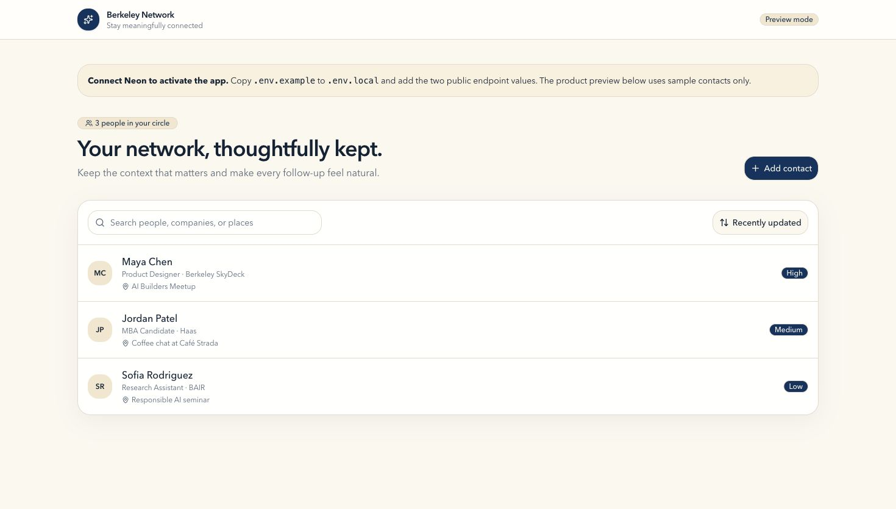
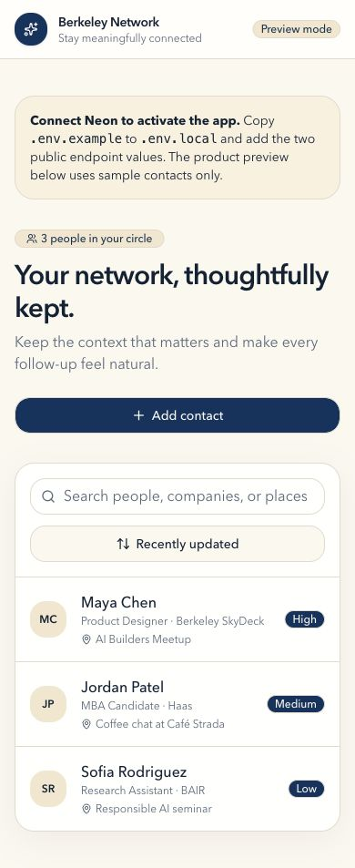
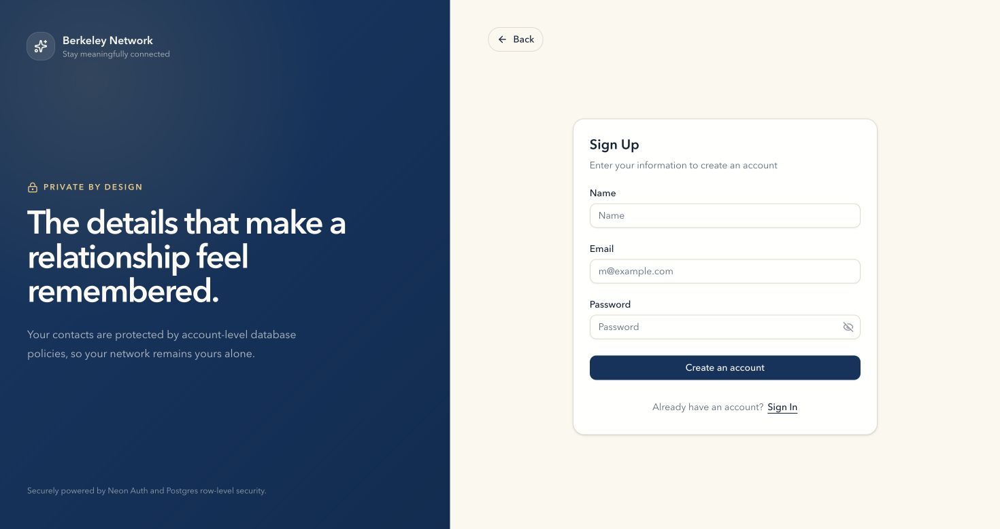

# Berkonnect

Berkonnect is a personal networking tracker. Use it to save contact details and notes. Each signed-in user can see only their own contacts. The application uses Next.js, Neon Managed Better Auth, the Neon Data API, and PostgreSQL row-level security (RLS).

**[Open the live application](https://personal-networking-tracker-hanif.vercel.app)** · **[Create an account](https://personal-networking-tracker-hanif.vercel.app/auth/sign-up)**

## Contents

- [Features](#features)
- [Technology stack](#technology-stack)
- [Architecture](#architecture-and-request-flow)
- [Local setup](#local-setup)
- [Database security](#database-security)
- [Test the application](#test-the-application)
- [Deploy the application](#deploy-the-application)

## Use the application

1. Create an account with an email address and a password.
2. Sign in.
3. Add a contact. Enter a name, company, role, meeting place, notes, and priority.
4. Search, filter, or sort your contacts.
5. Edit or delete a contact.
6. Sign out when you finish.

The desktop view uses a table. The mobile view uses contact cards. Both views provide the same actions.

### Responsive preview

| Desktop | Mobile |
| --- | --- |
|  |  |

### Production authentication



## Features

- Use email and password authentication through Neon Managed Better Auth
- Show Google or Microsoft SSO only after you configure each provider
- Store private contacts for each user
- Create, view, edit, and delete contacts
- Search the name, company, role, meeting place, and notes fields
- Filter by high, medium, or low priority
- Sort by recent update, newest created, name, or priority
- Check input in the browser and in PostgreSQL
- Loading, empty, no-results, success, error, and delete-confirmation states
- Responsive desktop table and mobile card layouts

## Technology stack

| Layer | Technology | Why it is used |
| --- | --- | --- |
| Frontend | Next.js 16, React 19, TypeScript | Render the application and enforce types |
| User interface | Tailwind CSS 4, shadcn/ui, Base UI, Lucide | Build consistent and keyboard-accessible controls |
| Forms | React Hook Form and Zod | Validate contact forms and show field errors |
| Data state | TanStack Query | Load, cache, and refresh contact data |
| Table | TanStack Table | Sort and filter contact data |
| Auth and data | `@neondatabase/neon-js` | Use Neon Auth and the Neon Data API |
| Database | Neon Postgres | Store contacts and enforce database rules |
| Tests | Vitest and an authenticated integration script | Run unit tests and the two-user security test |
| Hosting | Vercel | Host the Next.js application |

## Architecture and request flow

```mermaid
flowchart LR
  Browser[Next.js browser UI] -->|Sign up / sign in| Auth[Neon Managed Better Auth]
  Auth -->|JWT session| SDK[@neondatabase/neon-js]
  Browser --> SDK
  SDK -->|HTTPS + bearer token| API[Neon Data API]
  API -->|Authenticated role| DB[(Neon Postgres)]
  DB --> Constraints[CHECK constraints]
  DB --> RLS[Per-user RLS policies]
```

The browser uses two public HTTPS endpoints. The Neon client sends the signed-in user's token with each Data API request. PostgreSQL uses `auth.user_id()` and the RLS policies to select the correct rows. The deployed application does not use a PostgreSQL connection string.

## Local setup

Prerequisites:

- Node.js 20.19 or newer (Node.js 22 LTS recommended)
- npm
- A Neon project with Managed Better Auth and the Data API enabled

```bash
git clone https://github.com/patronofalltrades/Personal-Networking-Trakcer-AgenticAI-Course.git
cd Personal-Networking-Trakcer-AgenticAI-Course
npm install
cp .env.example .env.local
```

1. Copy the Neon Auth URL into `NEXT_PUBLIC_NEON_AUTH_URL`.
2. Copy the Neon Data API URL into `NEXT_PUBLIC_NEON_DATA_API_URL`.
3. Set `NEXT_PUBLIC_APP_URL` to `http://localhost:3000`.
4. Run [`database/migrations/001_create_contacts.sql`](database/migrations/001_create_contacts.sql) in the Neon SQL Editor or with a trusted migration connection.
5. Start the application:

```bash
npm run dev
```

Open [http://localhost:3000](http://localhost:3000).

## Project structure

```text
src/
├── app/                    # Next.js routes, layout, and providers
│   └── auth/[path]/        # Neon Auth sign-up and sign-in routes
├── components/             # Tracker workspace, auth shell, and UI primitives
├── lib/                    # Neon client, contact operations, and validation
└── types/                  # Contact and generated database types
database/migrations/        # Repeatable PostgreSQL schema and RLS policies
scripts/                    # Authenticated two-user RLS verification
docs/screenshots/           # Responsive and production evidence
```

## Environment variables

| Variable | Scope | Purpose |
| --- | --- | --- |
| `NEXT_PUBLIC_NEON_AUTH_URL` | Public | Neon Managed Better Auth HTTPS endpoint |
| `NEXT_PUBLIC_NEON_DATA_API_URL` | Public | Neon Data API `/rest/v1` HTTPS endpoint |
| `NEXT_PUBLIC_APP_URL` | Public | Canonical application URL for social metadata |
| `NEXT_PUBLIC_AUTH_SOCIAL_PROVIDERS` | Public | Comma-separated SSO providers configured in Neon Auth |
| `DATABASE_URL` | Local administration only | Optional trusted connection for schema tools; never expose or add to Vercel |
| `TEST_USER_A_EMAIL` / `TEST_USER_A_PASSWORD` | Local test only | First dedicated RLS test account |
| `TEST_USER_B_EMAIL` / `TEST_USER_B_PASSWORD` | Local test only | Second dedicated RLS test account |

Real values belong in `.env.local`, which is ignored by Git. `.env.example` contains placeholders only.

### Configure SSO buttons

1. Configure the provider in Neon Auth.
2. Use custom production credentials for that provider. Do not use Neon shared OAuth keys in production.
3. Add the provider name to `NEXT_PUBLIC_AUTH_SOCIAL_PROVIDERS`.
4. Use `google`, `microsoft`, or `google,microsoft`.
5. Restart or redeploy the application.

The application does not show an SSO button when its provider is not in this variable. Leave this variable empty until the Neon provider uses custom credentials. This prevents a user from selecting an incomplete or shared-key provider.

## Database schema

The complete, repeatable schema lives in [`database/migrations/001_create_contacts.sql`](database/migrations/001_create_contacts.sql).

| Column | Type | Rules |
| --- | --- | --- |
| `id` | `uuid` | Primary key; generated with `gen_random_uuid()` |
| `user_id` | `text` | Required; defaults to `auth.user_id()` |
| `name` | `text` | Required; trimmed value cannot be empty; maximum 120 characters |
| `company` | `text` | Optional; maximum 160 characters |
| `role` | `text` | Optional; maximum 160 characters |
| `where_met` | `text` | Optional; maximum 240 characters |
| `notes` | `text` | Optional; maximum 2,000 characters |
| `priority` | `text` | Required; only `high`, `medium`, or `low`; defaults to `medium` |
| `created_at` | `timestamptz` | Required; defaults to the current time |
| `updated_at` | `timestamptz` | Required; maintained by a database trigger |

An index on `(user_id, updated_at desc)` supports the default per-user list order.

## Database security

The migration creates `public.contacts`. It enables RLS. It grants table access to the `authenticated` role. It creates no policy for unauthenticated users. It creates four policies:

- `SELECT` returns rows where `auth.user_id() = user_id`.
- `INSERT` accepts a row only when `auth.user_id() = user_id`.
- `UPDATE` checks the old and new row. A user cannot transfer a row to another user.
- `DELETE` deletes a row only when `auth.user_id() = user_id`.

The application does not send `user_id` when it inserts a contact. PostgreSQL sets this value with `auth.user_id()`. The application does not accept or send `user_id` during an update.

## Test the application

Run the local checks:

```bash
npm run lint
npm run typecheck
npm test
npm run build
```

The unit tests check valid input, blank names, invalid priority values, and optional text.

Current unit output:

```text
Test Files  2 passed (2)
Tests       8 passed (8)
```

### Two-account security test

1. Create two test accounts in the application.
2. Put their email addresses and passwords in `.env.local`.
3. Run the integration test:

```bash
npm run test:integration
```

The test makes User A create a contact. It checks that User B cannot read, update, or delete that contact. It then checks that User A still has the original contact. It also sends invalid data to the Data API and checks that PostgreSQL rejects it.

## Deploy the application

1. Push the repository to GitHub.
2. Import the repository into Vercel as a Next.js project.
3. Add `NEXT_PUBLIC_NEON_AUTH_URL`, `NEXT_PUBLIC_NEON_DATA_API_URL`, and `NEXT_PUBLIC_APP_URL` in Vercel for Preview and Production.
4. Add `NEXT_PUBLIC_AUTH_SOCIAL_PROVIDERS` after you configure the listed providers in Neon Auth.
5. Do not add `DATABASE_URL` or test-account credentials to Vercel.
6. Deploy the application.
7. Add the production Vercel URL to Neon Auth trusted domains.
8. Test sign-up, sign-in, SSO, contact actions, refresh, search, filters, sorting, invalid input, and sign-out.

## Grading evidence

| Requirement | Evidence |
| --- | --- |
| Automated validation | Eight passing Vitest tests; command and output above |
| Sign-in and sign-out | Live sign-up and sign-in routes are connected to Neon Auth; production sign-up screenshot above |
| Create, edit, delete, and refresh | Implemented in `src/components/network-app.tsx`; persistence is provided by the Neon Data API |
| Invalid input fails safely | Zod unit tests plus database constraints in the applied Neon migration |
| Two-user isolation | Four explicit RLS policies plus the repeatable `npm run test:integration` two-account test |
| Schema and ownership | Applied Neon migration; live verification returned RLS enabled and four ownership policies |
| No committed secrets | `.gitignore`, placeholder-only `.env.example`, and final tracked-file/history scan |

## Current limits

- Google and Microsoft SSO require provider credentials in Neon Auth.
- Search and sort run in the browser after the user's contacts load.
- The application does not include reminders, calendar links, import, export, sharing, teams, or AI features.

## Improvements next

- Add server-side pagination for users with large contact lists.
- Add password recovery after its email delivery is configured.
- Add contact import and export with explicit user approval.

## Writing note

This README uses short sentences, direct instructions, consistent terms, and one action per step. These practices follow the goals of [ASD-STE100 Simplified Technical English](https://www.asd-ste100.org/). ASD-STE100 is a controlled language standard owned by ASD. This README is not a certified ASD-STE100 document.
